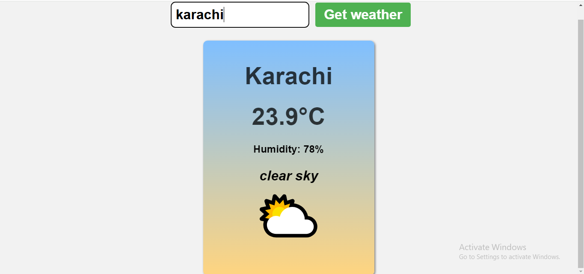

# Weather App

This is a simple weather application that allows users to enter a city name and view the current weather data including temperature, humidity, weather description, and an emoji representing the weather condition.

## Screenshot

## Live Demo

[View the live project here!](https://laibatariq110.github.io/Weather-App)

## Features

- Users can input a city name to get the current weather data.
- Displays temperature in Celsius, humidity percentage, and weather description.
- Displays weather-related emojis based on the weather conditions.
- Handles errors when city input is invalid or if the weather data cannot be fetched.

## Files

- `index.html`: The main HTML file for the structure of the app.
- `style.css`: The CSS file for styling the app.
- `script.js`: The JavaScript file responsible for fetching weather data from the OpenWeatherMap API and displaying it.
- `weather-app-ss.png`: A screenshot showing the app interface.

## Setup

1. Clone or download the repository.
2. Open the `index.html` file in your web browser.

## API Key

The app uses the [OpenWeatherMap API](https://openweathermap.org/) to fetch weather data. The API key is currently hardcoded in the `script.js` file. You can replace it with your own API key by following the instructions on their website.

## How it Works

1. The user enters the city name in the input field and clicks "Get weather".
2. The app fetches weather data from the OpenWeatherMap API based on the entered city.
3. If successful, the app displays the city name, temperature, humidity, description, and an emoji representing the weather.
4. If there is an error (e.g., city not found), an error message is displayed.
